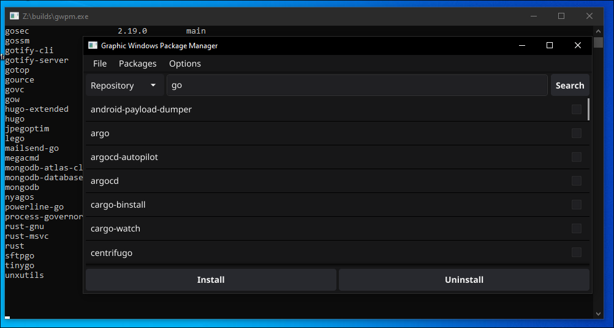

# Graphic Windows Package Manager

A package manager for windows... as the name suggests.

## Screenshots




## Installation

Install my-project with go or downloading the portable binary!

```bash
go install -v github.com/Tom5521/GWPM@latest
```

If you want to use this program you will have to install one of the package
managers that the program supports.

For now these are the supported package managers and their installation guides

- [Chocolatey](https://chocolatey.org/install)🍫
- [Scoop](https://scoop.sh)🍨

**You can also install them through the program itself, you simply have to
select in the configuration a package manager not installed,
if you do not have any installed, you can use the automatic installer
that the program has.**

## Support

For support, open an issue and (probably) respond quickly and concisely.

Although I (from time to time) tend to be very busy, because of the whole
having a life thing.

## Authors

- [@Tom5521](https://www.github.com/Tom5521)(me :D)

## Acknowledgements

- [Awesome README](https://github.com/matiassingers/awesome-readme)

## License

[MIT](https://choosealicense.com/licenses/mit/)
